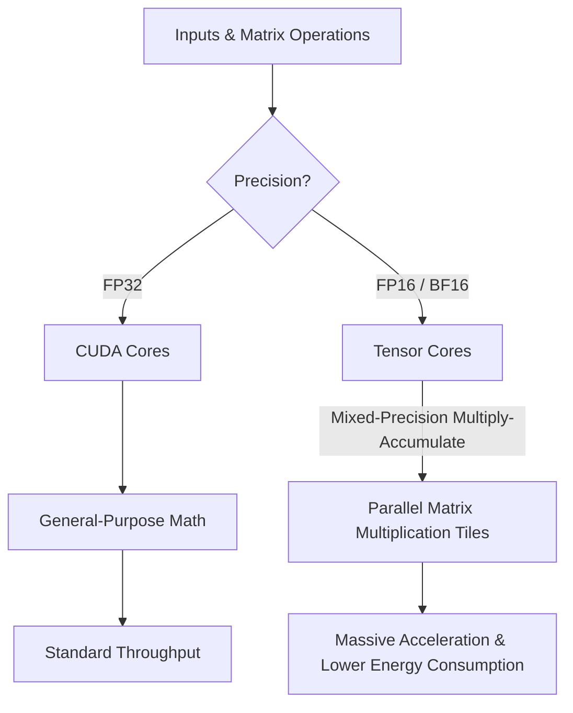

# Floating-Point Precision & GPU Performance

In deep learning and high-performance computing (HPC), selecting the correct numeric precision is one of the most critical factors for optimizing model training and inference. Understanding how different floating-point formats are represented in hardware and how they map to GPU execution pipelines is key to maximizing throughput and energy efficiency.

---

## 1. Floating-Point Representations: FP32, FP16, and BF16

A floating-point number is represented in binary using three parts: the **Sign** (determines positive/negative), the **Exponent** (determines the scale or dynamic range), and the **Mantissa/Fraction** (determines the precision or decimal accuracy).

| Format | Total Bits | Sign Bits | Exponent Bits | Mantissa (Fraction) Bits | Range & Precision Profile |
|--------|------------|-----------|---------------|--------------------------|---------------------------|
| **FP32** (Single) | 32 | 1 | 8 | 23 | Standard baseline. High precision, wide range, but high memory and compute footprint. |
| **FP16** (Half) | 16 | 1 | 5 | 10 | High precision for 16-bit, but narrow range. Prone to underflow/overflow; requires loss scaling. |
| **BF16** (Brain) | 16 | 1 | 8 | 7 | Matches FP32 range, but lower precision. Extremely stable for deep learning without loss scaling. |

### Exponent vs. Mantissa Trade-off
*   **FP16** allocates more bits (10) to the mantissa, yielding higher precision (~3.3 decimals). However, its 5-bit exponent limits its maximum range (up to 65,504), which can cause gradients to underflow or overflow during training.
*   **BF16** trades off mantissa bits (down to 7) to allocate 8 bits to the exponent, matching the range of FP32. This makes it a drop-in replacement for FP32 in most deep learning tasks, as it handles the same range of weights and gradients without requiring numerical workarounds like dynamic loss scaling.

---

## 2. Hardware Routing: CUDA Cores vs. Tensor Cores

The precision format dictates how arithmetic instructions are routed within the physical GPU architecture:

*   **Standard CUDA Cores**: Designed for general-purpose floating-point arithmetic (e.g., standard FP32 calculations). They process operations in a standard single-instruction fashion, computing one multiply-accumulate operation per clock cycle per core.
*   **Tensor Cores**: Specialized execution units designed specifically for ad-hoc high-speed matrix multiply-accumulate operations ($D = A \times B + C$). They process entire matrix tiles in parallel. Tensor Cores only activate when executing mixed-precision math (e.g., multiplying FP16/BF16 inputs and accumulating the result in FP32).

---

## 3. Impact on Performance and Efficiency

Using mixed-precision (FP16 or BF16) instead of single-precision (FP32) delivers major performance benefits across three dimensions:

1.  **Throughput Boost**: By routing calculations through Tensor Cores, GPUs can achieve multiple times the theoretical TFLOP/s throughput compared to standard CUDA cores executing FP32.
2.  **Memory Bandwidth & Footprint**: Halving the bit-width (from 32-bit to 16-bit) halves the memory capacity required to store model weights, activations, and gradients. This allows larger batch sizes, bigger models, and reduces memory bandwidth bottlenecks during data transfer.
3.  **Energy Efficiency**: Tensor Cores perform matrix calculations much more efficiently per watt than standard CUDA cores. Operating on 16-bit datatypes reduces the energy required to transfer data and execute operations, leading to significantly higher compute-per-joule efficiency.
