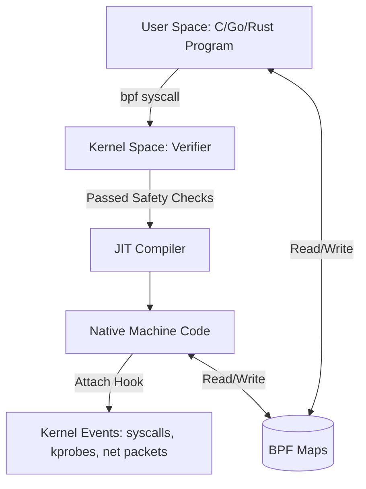

# Linux Internals: The SRE Safety Net

When engineers ask about "Linux Internals," they are often testing whether you understand how the OS affects your application performance. You don't need to memorize the kernel source code; you just need to know where the "knobs" are and how to interpret common metrics.

## Linux Server Review (The 'SadServers' Way)

### The "Safety Net" Logic
If a process is slow or crashing, the problem is almost always one of these four: **CPU**, **Memory**, **Disk (I/O)**, or **Network**.

---

## 1. Quick Triage (Load & Basics)
*   `uptime`: Check load averages (1, 5, 15 min). Load > # of cores = saturation.
*   `top` / `htop`: Real-time view of processes and resource consumers.
*   `ps auxf`: Process tree; `f` shows parent/child relationships (useful for identifying worker leaks).
*   `uname -a` & `cat /etc/debian_version`: Quick check of kernel and distro version.

---

## 2. CPU & Performance
*   `mpstat -P ALL 1`: Check CPU balance. Are all cores busy, or just one (single-threaded bottleneck)?
*   `pidstat 1`: Per-process CPU usage. Identify which PID is specifically spiking.
*   `lscpu`: Verify CPU architecture and core count.

---

## 3. Memory & Virtual Memory
*   `free -m`: Quick overview of used/cached/free memory.
*   `vmstat 1`: Check `r` (runnable) and `b` (uninterruptible sleep/disk wait). High `si`/`so` means swapping!
*   `grep -i oom /var/log/syslog`: Check if the OOMKiller has been active recently.

#### Virtual vs. Physical Memory (VIRT vs. RSS)
*   **VIRT (Virtual Memory)**: The absolute total memory a process can "see". It includes shared libraries, swapped out pages, and memory requested via `malloc()` but not yet used.
*   **RSS (Resident Set Size)**: The actual amount of physical RAM the process is using right now.
*   **Lazy Allocation (Demand Paging)**:
    1.  When a process calls `malloc()`, the kernel gives it **Virtual Memory** (VIRT increases). It's just a "promise" of space.
    2.  The kernel only allocates **Physical Memory** (RSS increases) when the process actually **touches** the address (reads or writes).
    3.  This first touch triggers a **Page Fault**, and the kernel then maps a real physical page to that virtual address.

---

## 4. Disk & I/O
*   `df -h`: Check for full filesystems. 100% disk = certain failure for most apps.
*   `df -i`: Check for **Inode exhaustion**. You can have GBs free but 0 inodes.
*   `iostat -xz 1`: Check `%util`. If a disk is at 100% util, it's the bottleneck.
*   `lsblk -f`: List block devices and their filesystems.
*   `du -mxS / | sort -n | tail -10`: Find the top 10 largest files in a directory.

---

## 5. Networking & Connectivity
*   `ss -tlpn`: (Socket Stat) What processes are listening on which ports?
*   `ss -s`: Summary of socket statistics (TCP/UDP/ESTAB).
*   `ip -s link`: Check for interface errors or dropped packets.
*   `netstat -i`: Network interface statistics.
*   `iptables -L -n -t nat`: Check firewall and NAT rules (don't forget `-t nat` for K8s/Docker!).

---

## 6. Logs & systemd
*   `journalctl -xe`: View the most recent system logs with explanations.
*   `journalctl -u nginx`: View logs for a specific service.
*   `journalctl -k`: View kernel messages (equivalent to `dmesg`).
*   `systemctl --failed`: List all units that failed to start.
*   `systemd-analyze blame`: See which services are making boot-up slow.

---

## 7. Isolation & Namespaces (Boundaries)
Namespaces define what a process can **see**. They create isolated views of system resources.

*   **PID Namespace**: The process thinks it is PID 1.
*   **Network Namespace**: Private network stack (interfaces, routing, IP).
*   **Mount Namespace**: Independent filesystem mount points.
*   **UTS Namespace**: Custom hostname.
*   **IPC Namespace**: Isolated inter-process communication.
*   **User Namespace**: Map internal IDs to different external IDs (e.g., internal root = external nobody).

### Control Groups (cgroups)
Cgroups define how much a process can **use**. They enforce resource limits (CPU, Memory, I/O) and prevent "noisy neighbors" from starving other processes.

---

## 8. Virtual File System (VFS) & Storage
Linux treats "everything as a file" via the **VFS** abstraction layer.

### Inodes (The File's Identity)
An **Inode** is a data structure containing metadata about a file (permissions, owner, size, data block addresses).
*   **Crucial Fact**: The **Filename** is NOT stored in the Inode. It's stored in the directory entry that points to the Inode.
*   **Links**: A **Hard Link** is just another directory entry pointing to the same Inode. A **Symlink** is a special file containing the path to another Inode.

### File Behavior & Inodes
*   **`cp` (Copy)**: Creates a NEW Inode.
*   **`mv` (Move)**: Keeps the SAME Inode (just renames the directory entry pointer).
*   **`sed -i` (Edit in place)**: Often creates a temporary file (new Inode) and renames it over the original. This can break tools (like `tail -f`) that are watching the original Inode!

### File Descriptors (FD)
A **File Descriptor** is a process-level integer that index into the kernel's open file table. By default, 0 is stdin, 1 is stdout, and 2 is stderr.

---

## 9. eBPF (Extended Berkeley Packet Filter)
eBPF is a revolutionary technology that allows running sandboxed programs inside the Linux kernel without modifying the kernel source code or loading external kernel modules. It provides high-performance, safe observability, networking, and security.

### How eBPF Works (The Lifecycle)
1. **Compilation**: Write eBPF program (typically in C, Go, or Rust) and compile it into eBPF bytecode using LLVM/Clang.
2. **Loading**: Load bytecode into the kernel using the `bpf()` system call.
3. **Verification (Safety)**: The kernel **Verifier** statically analyzes the program to ensure it is safe (e.g., no infinite loops, no out-of-bounds memory access, must terminate, cannot crash the kernel).
4. **JIT Compilation**: The kernel compiles the bytecode into native machine instructions for maximum execution speed.
5. **Event Attachment**: The program is attached to a specific kernel hook (e.g., kprobes, tracepoints, network packets). When the event fires, the eBPF program runs.
6. **Data Sharing (Maps)**: eBPF programs use **BPF Maps** (key-value stores in kernel memory) to share data (metrics, logs, configurations) with user-space applications.

### eBPF Maps (Data Sharing & Communication)
eBPF programs are isolated and cannot access arbitrary kernel memory. To communicate with user-space applications (or share state between different eBPF programs), they use **BPF Maps**—efficient, key-value data structures residing in kernel space.

#### 1. Core Map Types & Use Cases
*   **Hash Tables (`BPF_MAP_TYPE_HASH` / BCC `BPF_HASH`)**:
    *   Store key-value pairs of arbitrary sizes.
    *   *Example*: Mapping a syscall ID (key) to a counter (value) to count system calls across the OS (e.g., in Liz Rice's `hello-map.py` example).
*   **Arrays (`BPF_MAP_TYPE_ARRAY` / BCC `BPF_ARRAY`)**:
    *   Fixed-size arrays indexed by integer keys from `0` to `max_entries - 1`. Faster lookups but cannot delete elements.
*   **Perf Buffer (`BPF_MAP_TYPE_PERF_EVENT_ARRAY` / BCC `BPF_PERF_OUTPUT`)**:
    *   Used for streaming structured events from the kernel to user space.
    *   Allocates a memory buffer per CPU core. Can lead to out-of-order events or packet loss under high-throughput conditions if the buffer fills up.
*   **Ring Buffer (`BPF_MAP_TYPE_RINGBUF` / BCC `BPF_RINGBUF_OUTPUT`)**:
    *   Introduced in Linux 5.8 to replace the Perf Buffer.
    *   Uses a single, lockless ring buffer shared across all CPU cores. Solves memory fragmentation, improves performance, and guarantees in-order event delivery.
*   **Program Array (`BPF_MAP_TYPE_PROG_ARRAY`)**:
    *   Stores file descriptors of other loaded eBPF programs, enabling **Tail Calls** (jumping from one eBPF program to another to bypass the program size limit or modularize processing).

#### 2. Key Map Operations (C Helper Functions)
Within an eBPF program, helpers are used to manipulate map elements safely:
*   `void *bpf_map_lookup_elem(map, &key)`: Returns a pointer to the value associated with the key, or `NULL` if not found. **Important**: The eBPF verifier requires you to null-check the returned pointer before dereferencing it.
*   `long bpf_map_update_elem(map, &key, &value, flags)`: Inserts or updates a key-value pair.
*   `long bpf_map_delete_elem(map, &key)`: Deletes the key-value pair.

#### 3. Configuration & Interaction
User-space programs configure and query maps using library APIs (e.g., BCC Python wrapper `b["config"][key] = value` or libbpf API calls), which under the hood invoke the `bpf(BPF_MAP_LOOKUP_ELEM, ...)` system calls using the map's file descriptor.

### eBPF Hook Points & Tracing Types
*   **kprobes (Kernel Probes)**: Dynamic hooks on any kernel function entry (`kprobe`) or return (`kretprobe`). Highly flexible but unstable (can break across kernel versions).
*   **uprobes (User Probes)**: Dynamic hooks on user-space applications (e.g., tracing a function in a Go binary or monitoring HTTPS traffic).
*   **Tracepoints**: Static trace hooks compiled directly into the kernel by developers. Stable API but limited to predefined points.
*   **XDP (eXpress Data Path)**: Attaches directly to the network driver interface. Allows packet filtering, redirection, or dropping at the earliest possible stage (before allocating kernel socket buffers (`sk_buff`)), enabling extremely fast DDoS mitigation.

### Key Tools & Projects
*   **`bpftrace`**: A high-level tracing compiler that allows writing quick one-liners (similar to `awk` or `dtrace`) for ad-hoc debugging.
*   **BCC (BPF Compiler Collection)**: A framework for building complex tracing scripts, utilizing Python/C to inspect and manipulate kernel state.
*   **Cilium**: An eBPF-powered CNI (Container Network Interface) for Kubernetes providing cloud-native networking, load balancing, and security.
*   **Tetragon**: An eBPF-based security observability agent providing real-time runtime enforcement.

---

*Sources: [SadServers](https://docs.sadservers.com/docs/troubleshooting/linux-server-review/), [Dev.to - Linux FS](https://dev.to/kanywst/linux-file-system-architecture-a-deep-dive-into-vfs-inodes-and-storage-1n9), [ByteByteGo], [eBPF.io](https://ebpf.io/)*

*Last updated: 2026-06-20*
