# Network Troubleshooting Test Flow

Most network issues look complicated, but the troubleshooting process doesn’t have to be. A reliable way to diagnose problems is to test the network layer by layer, starting from your own machine and moving outward until you find exactly where things break.

## Troubleshooting Workflow

The following flow provides a structured checklist that mirrors how packets actually move through a system.

```mermaid
graph TD
    Start([Start]) --> LocalCheck[Local System Check<br/>Test TCP/IP stack & NIC status]
    
    LocalCheck --> PingLocal{ping 127.0.0.1<br/>& Verify NIC enabled}
    PingLocal -- NO --> FixLocal[Fix TCP/IP / Enable NIC]
    FixLocal --> PingLocal
    PingLocal -- YES --> LocalIP[Test Local IP Configuration<br/>Check local IP & self-connectivity]
    
    LocalIP --> PingSelf{Verify DHCP/Static IP<br/>+ ping self IP}
    PingSelf -- NO --> FixIP[Fix DHCP / IP config / firewall]
    FixIP --> PingSelf
    PingSelf -- YES --> LAN[Test LAN Connectivity<br/>Check LAN gateway reachability]
    
    LAN --> PingGW{ARP resolution +<br/>ping default gateway}
    PingGW -- NO --> FixLAN[Fix cable / switch / IP conflict]
    FixLAN --> PingGW
    PingGW -- YES --> Routing[Test Internal Routing]
    
    Routing --> PingExit{Check default route +<br/>ping exit router}
    PingExit -- NO --> FixRoute[Fix routing table / router uplink / ACL]
    FixRoute --> PingExit
    PingExit -- YES --> WAN[Test ISP/WAN Connectivity<br/>Verify WAN link & ISP gateway]
    
    WAN --> PingWAN{Check WAN interface IP +<br/>ping ISP gateway}
    PingWAN -- NO --> FixWAN[Fix DHCP/PPPoE/modem/ONT/NAT/ISP]
    FixWAN --> PingWAN
    PingWAN -- YES --> Internet[Test Internet Connectivity<br/>Check external Internet reachability]
    
    Internet --> PingPublic{ping 8.8.8.8<br/>public DNS IP}
    PingPublic -- NO --> FixInternet[Fix upstream routing / ISP issues]
    FixInternet --> PingPublic
    PingPublic -- YES --> DNS[DNS Resolution]
    
    DNS --> NSLookup{nslookup or dig<br/>domain name}
    NSLookup -- NO --> FixDNS[Fix DNS server config / change DNS]
    FixDNS --> NSLookup
    NSLookup -- YES --> Target[Test Target & Application<br/>Check target host & service]
    
    Target --> PingTarget{ping target IP +<br/>test TCP port}
    PingTarget -- NO --> FixTarget[Fix server / ICMP / firewall / service / port]
    FixTarget --> PingTarget
    PingTarget -- YES --> OK([NETWORK OK!])
    
    style Start fill:#f9f,stroke:#333,stroke-width:2px
    style OK fill:#0f0,stroke:#333,stroke-width:2px
    style FixLocal fill:#f66,stroke:#333,stroke-width:1px
    style FixIP fill:#f66,stroke:#333,stroke-width:1px
    style FixLAN fill:#f66,stroke:#333,stroke-width:1px
    style FixRoute fill:#f66,stroke:#333,stroke-width:1px
    style FixWAN fill:#f66,stroke:#333,stroke-width:1px
    style FixInternet fill:#f66,stroke:#333,stroke-width:1px
    style FixDNS fill:#f66,stroke:#333,stroke-width:1px
    style FixTarget fill:#f66,stroke:#333,stroke-width:1px
```

## Step-by-Step Breakdown

### 1. Local System Check
Ensure your computer's networking stack is functioning.
- **Action**: `ping 127.0.0.1` (loopback address) and check if the Network Interface Card (NIC) is enabled.
- **Troubleshooting**: If this fails, the issue is likely software (TCP/IP stack corruption) or hardware (NIC disabled/broken).

### 2. Test Local IP Configuration
Verify that your machine has a valid IP address and can talk to itself.
- **Action**: Check your IP (e.g., `ip addr` or `ifconfig`) and `ping` your own IP.
- **Troubleshooting**: Check DHCP settings, static IP configurations, or local firewall rules blocking self-connectivity.

### 3. Test LAN Connectivity
Check if you can reach other devices on your local network.
- **Action**: `ping` your default gateway (usually your router's IP). Check `arp -a` to see if MAC addresses are resolving.
- **Troubleshooting**: Check cables, network switches, or look for IP address conflicts on the subnet.

### 4. Test Internal Routing
Verify that packets can leave the local subnet properly.
- **Action**: Check your routing table (`ip route`) and `ping` the next-hop router if applicable.
- **Troubleshooting**: Fix incorrect static routes, check router uplinks, or check Access Control Lists (ACLs).

### 5. Test ISP/WAN Connectivity
Confirm the connection to your Internet Service Provider.
- **Action**: Check the external WAN interface IP and `ping` the ISP's gateway.
- **Troubleshooting**: Check the modem, ONT (Optical Network Terminal), or PPPoE/DHCP status with the ISP.

### 6. Test Internet Connectivity
Verify if you can reach a known stable IP on the public Internet.
- **Action**: `ping 8.8.8.8` (Google's Public DNS) or `1.1.1.1` (Cloudflare).
- **Troubleshooting**: Issues here usually point to upstream routing problems or ISP-wide outages.

### 7. DNS Resolution
Confirm that domain names are being translated into IP addresses.
- **Action**: `nslookup google.com` or `dig google.com`.
- **Troubleshooting**: Update `/etc/resolv.conf`, check local DNS cache, or switch to a different DNS provider (e.g., Google or Cloudflare).

### 8. Test Target & Application
Check if the specific target server and service are available.
- **Action**: `ping <target_ip>` and test the specific service port (e.g., `telnet <ip> 80` or `nc -zv <ip> 443`).
- **Troubleshooting**: The target server might be down, ICMP might be blocked by a firewall, or the application service (port) might not be running.

---

*Source: [ByteByteGo - Network Troubleshooting Test Flow](https://blog.bytebytego.com/i/185515517/network-troubleshooting-test-flow)*

*Last updated: 2026-03-25*
