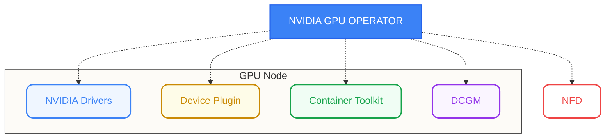

# GPU Operator, CDI, and DRA

Modern Kubernetes infrastructure for managing accelerator lifecycle, standardizing device access, and dynamic resource management.

## NVIDIA GPU Operator

The NVIDIA GPU Operator automates the management of all NVIDIA software components needed to provision GPUs in Kubernetes.


<p align="center"><em>Every available GPU nodes will be configured with required components and configurations</em></p>

### Core Components (Operands)
- **NVIDIA Driver**: Low-level kernel drivers (can be containerized).
- **NVIDIA Container Toolkit**: Configures container runtimes (containerd/CRI-O) to mount GPU resources.
- **NVIDIA Device Plugin**: Traditional mechanism for exposing GPUs as extended resources (`nvidia.com/gpu`).
- **GPU Feature Discovery (GFD)**: Labels nodes with GPU attributes (model, memory, capabilities).
- **DCGM Exporter**: Exports GPU telemetry (utilization, power, temperature) for Prometheus.
- **MIG Manager**: Manages Multi-Instance GPU (MIG) partitioning.

### Common Configuration (Helm)
```bash
helm install gpu-operator nvidia/gpu-operator \
  --set driver.enabled=true \
  --set toolkit.enabled=true \
  --set psp.enabled=false
```

---

## CDI (Container Device Interface)

CDI is an open specification for container runtimes (containerd, CRI-O) to standardize how third-party devices are made available to containers.

- **Standardization**: Replaces runtime-specific hooks with a declarative JSON descriptor.
- **Mechanism**: The device plugin returns a fully qualified device name (e.g., `nvidia.com/gpu=0`), and the runtime uses the CDI spec to inject device nodes, environment variables, and mounts.
- **Benefits**: Simplifies the path from device plugin to low-level runtime (runc), moving complex logic out of the runtime itself.

---

## DRA (Dynamic Resource Allocation)

DRA is the next-generation resource management API in Kubernetes (introduced in v1.26, evolving in v1.31+), moving beyond the limitations of the Device Plugin API.

### Key Concepts
- **`ResourceClaim`**: A request for specific hardware resources (similar to PVC for storage).
- **`DeviceClass`**: Defines categories of devices (e.g., "high-memory-gpus") with specific filters.
- **`ResourceSlice`**: Represents the actual hardware availability on nodes.

### Benefits over Device Plugins
1. **Rich Filtering**: Use CEL (Common Expression Language) to request specific attributes (e.g., `device.memory >= 24Gi`).
2. **Device Sharing**: Better native support for sharing devices across multiple containers/pods.
3. **Hardware Topology**: Improved awareness of PCIe/NVLink topologies for multi-GPU workloads.
4. **Decoupled Lifecycle**: Allocation happens during scheduling, allowing for more complex "all-or-nothing" scheduling for multi-node jobs.

### Example Claim
```yaml
apiVersion: resource.k8s.io/v1alpha3
kind: ResourceClaim
metadata:
  name: gpu-claim
spec:
  devices:
    requests:
    - name: my-gpu
      deviceClassName: nvidia-h100
      selectors:
      - cel: "device.memory >= 80Gi"
```

---

*Last updated: 2026-03-02*
