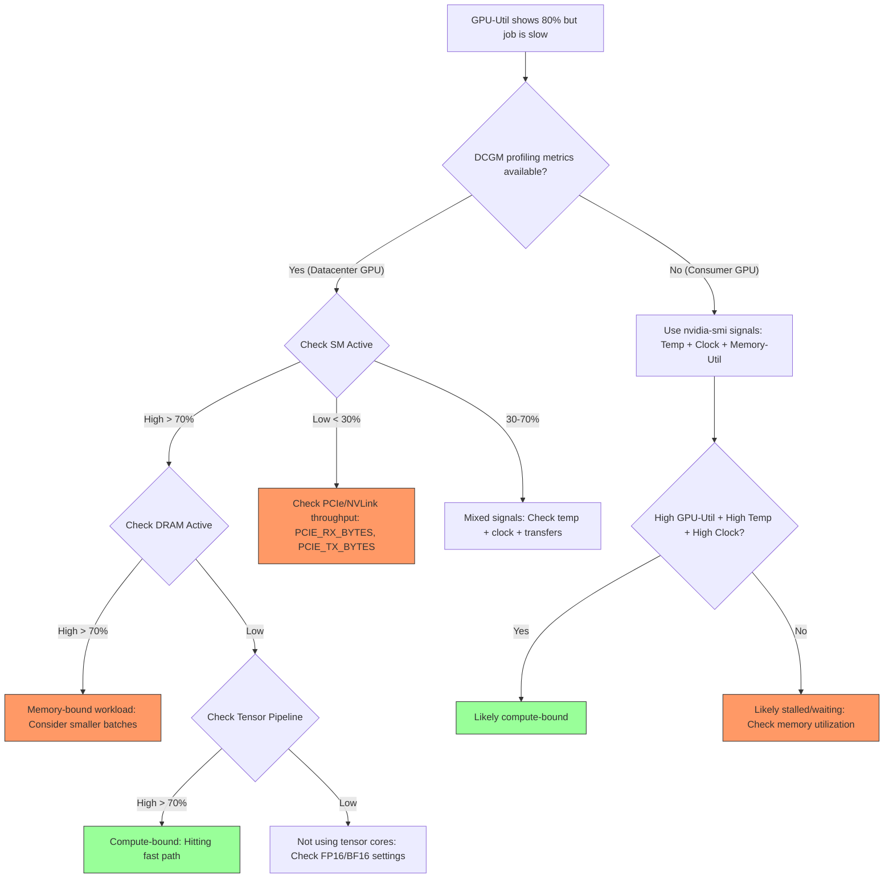
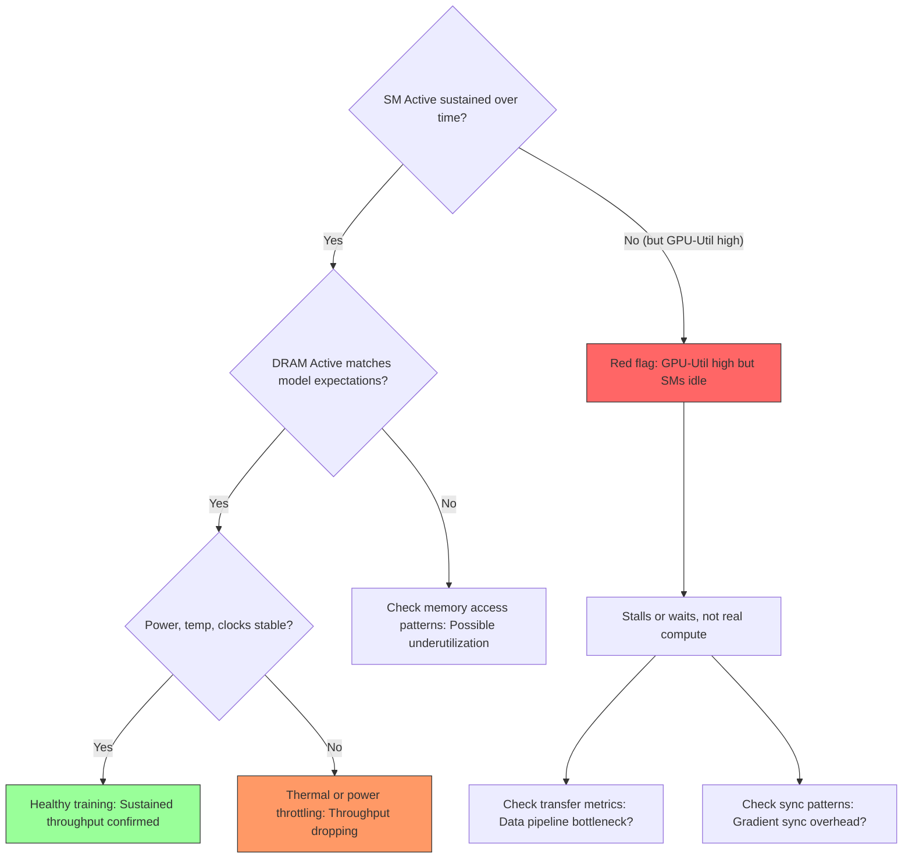
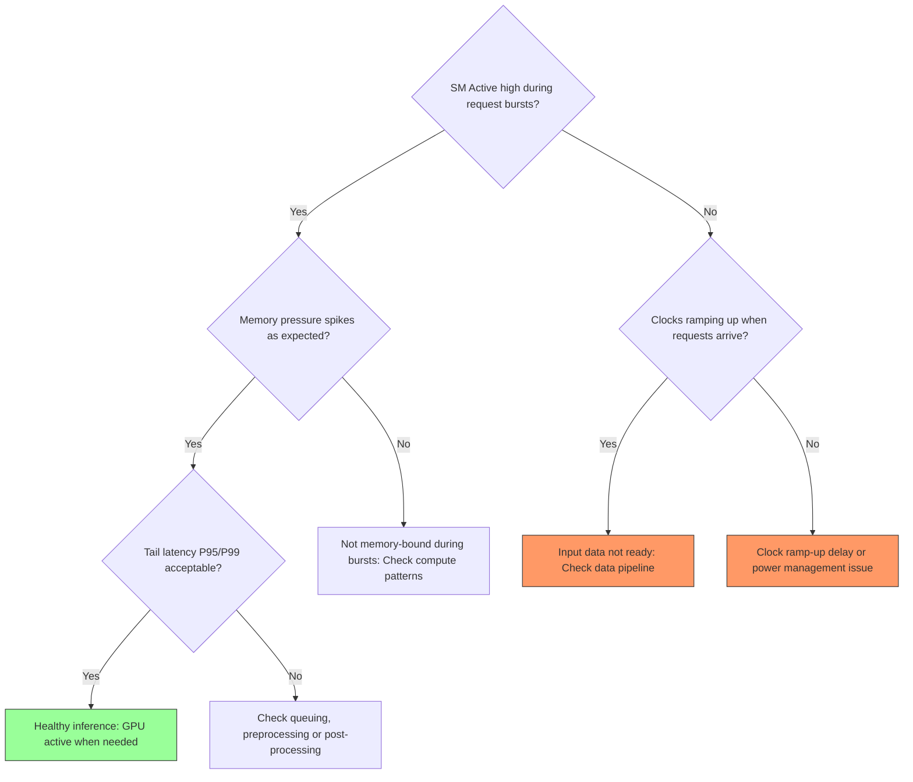
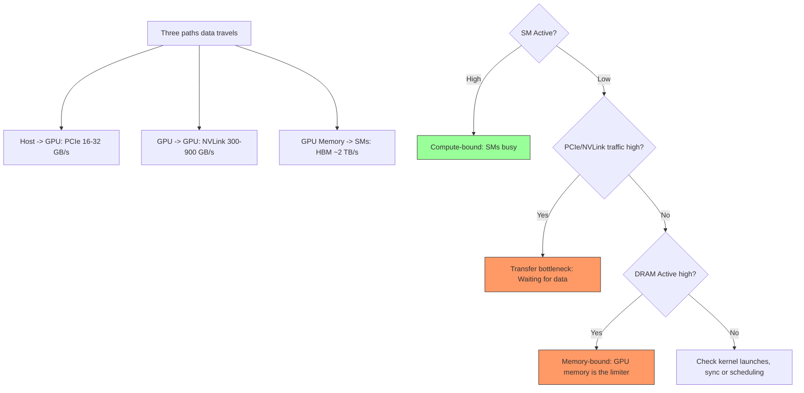

# GPU Performance: Data Movement & Bottlenecks

Understanding how data flows through a system is critical for identifying why a GPU might be underutilized.

## How Data Moves

The journey of data from storage to the GPU execution unit involves multiple hops, each a potential bottleneck.

### 1. Storage to CPU RAM
Data is loaded from disk (SSD, Parallel Filesystem like Lustre/WEKA) into Host Memory (RAM).
- **Bottleneck**: I/O throughput of the storage system or network (if using remote storage).

### 2. CPU RAM to GPU VRAM (The PCIe Pipe)
The CPU orchestrates the transfer of data from RAM to the GPU's onboard memory (VRAM) via the PCIe bus.
- **Bottleneck**: PCIe bandwidth. Even PCIe Gen 5 (64GB/s x16) is significantly slower than GPU VRAM bandwidth (>2TB/s on H100).
- **Optimization**: Use **GPUDirect Storage (GDS)** to bypass the CPU and move data directly from storage/NIC to GPU memory.

### 3. GPU to GPU (NVLink)
In multi-GPU setups, gradients and data are exchanged between GPUs.
- **Bottleneck**: PCIe is often too slow for this. **NVLink** provides a dedicated, high-speed interconnect (up to 900GB/s on H100) that allows GPUs to talk directly without involving the CPU.

---

## Debugging Bottlenecks with DCGM

To identify where the "stall" is happening, monitor specific DCGM metrics and follow these decision paths.

### Identifying the Bottleneck

### Workload Specific Flowcharts

#### 1. Training (Steady, long-running)

#### 2. Inference (Bursty, latency-sensitive)

### Summary of Data Travel Paths

| Metric | Focus | Insight |
|--------|-------|---------|
| `DCGM_FI_PROF_PCIE_TX_BYTES` | PCIe Outbound | High values indicate heavy data transfer from GPU to Host. |
| `DCGM_FI_PROF_PCIE_RX_BYTES` | PCIe Inbound | High values indicate the CPU is feeding the GPU at the bus limit. |
| `DCGM_FI_DEV_MEM_COPY_UTIL` | Memory Controller | Percentage of time spent moving data in/out of VRAM. |
| `DCGM_FI_DEV_GPU_UTIL` | Compute Engine | If this is low while `PCIE_RX` is high, the GPU is **Data Starved**. |

### Interpreting Graphs

> [!TIP]
> **The "Data Stall" Pattern**: You see low `GPU_UTIL` (e.g., 20-30%) but `PCIE_RX_BYTES` is pegged at the theoretical maximum of your PCIe generation. This confirms the bottleneck is the PCIe bus.

> [!IMPORTANT]
> **MIG Bottlenecks**: When using MIG, remember that the PCIe bandwidth is shared across all instances on the physical GPU. One aggressive instance can starve others.

---

## Performance Checklist
- **Check PCIe Link Speed**: Ensure the GPU is actually negotiated at its maximum rated speed (e.g., x16 Gen4).
- **Monitor NVLink Error Rates**: Use `nvidia-smi nvlink -g 0` to check for CRC errors which might indicate faulty hardware slowing down transfers.
- **CPU Affinity**: Ensure the process is pinned to the CPU socket physically closest to the GPU to minimize PCIe latency.

---

*Last updated: 2026-03-07*
