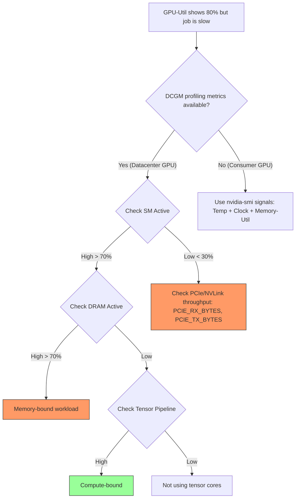

# GPU Performance & Troubleshooting

## Identifying Bottlenecks

Follow these decision paths to find out why your workload is slow.

*(See detailed training/inference flowcharts in the full note content)*

---

## Hardware Faults & XIDs

XID errors are reports from the NVIDIA driver indicating hardware or driver-level failures.

### Common XID Codes
- **XID 31 (Page Fault)**: Invalid memory access. Software or faulty HW.
- **XID 61 (Internal Error)**: Firmware error, usually requires reboot.
- **XID 79 (Falling off the Bus)**: GPU is unresponsive. PCIe link issue.

### ECC Errors
- **Single-Bit (SBE)**: Automatically corrected.
- **Double-Bit (DBE)**: Uncorrectable. Crashes application to prevent corruption. Requires GPU reset.

---

## Diagnostic Checklist
- **PCIe Link Speed**: Verify `x16 Gen4/5` negotiation.
- **Thermal Throttling**: Check if Clocks drop under load.
- **CPU Affinity**: Ensure Pod is on the same NUMA node as the GPU.

---

*Last updated: 2026-03-07*
