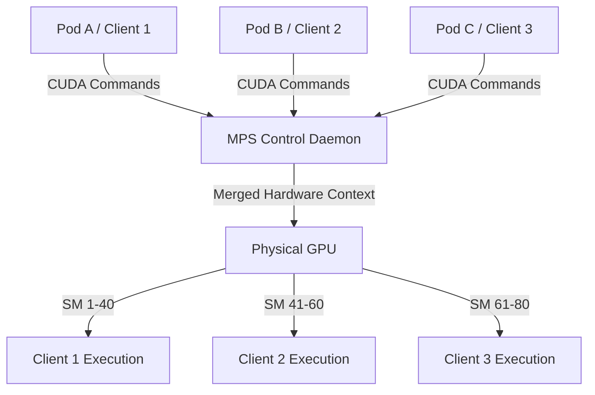

# GPU Sharing in Kubernetes

Kubernetes naturally schedules GPUs as monolithic integer units (e.g., requesting `nvidia.com/gpu: 1`). For lightweight workloads like model inference or small development tasks, assigning a full physical GPU is highly inefficient. To optimize utilization, fractional sharing mechanisms allow partitioning a single physical GPU across multiple containers.

---

## 1. Technologies Comparison

| Sharing Mechanism | Layer | Compute Isolation | Memory Isolation | Performance Overhead | Best Use Case |
|:-------------------|:------|:------------------|:-----------------|:---------------------|:--------------|
| **Time-Slicing** | Driver / Software | None (Temporal) | None (Shared) | Low | Dev/Test, Batch workloads |
| **NVIDIA MPS** | Software Daemon | Logical (SM limits) | Logical (Caps) | Low | Multi-tenant inference, high density |
| **NVIDIA MIG** | Hardware / Silicon | Strict (Dedicated SMs) | Strict (Partitioned) | None | Production, SaaS, multi-tenant |
| **vGPU** | Hypervisor / VM | Strict (Time quotas) | Strict (Allocated) | Low to Medium | Hybrid cloud, enterprise VDI |

---

## 2. Software-Based Sharing (Temporal Multiplexing)

These mechanisms do not physically partition the GPU silicon; instead, they manage how workloads share the device over time.

### A. Time-Slicing (The "Polite Lie")
Time-slicing works by configuring the NVIDIA device plugin to advertise multiple "replicas" of a single physical GPU (e.g., declaring 4 virtual GPUs for 1 physical card).
*   **Mechanism**: Kubernetes schedules multiple pods to the node. All pods run on the same GPU and share the same CUDA context. The GPU driver context-switches between processes.
*   **Limitations**: 
    *   **No compute isolation**: CUDA kernels run to completion and cannot be preempted. If one container submits a heavy, long-running kernel, all other containers sharing the GPU are blocked.
    *   **No memory protection**: There is no VRAM enforcement. If one container experiences an Out of Memory (OOM) error or consumes all memory, it can crash the workloads in adjacent containers.

### B. Kubernetes AI (KAI) Scheduler Reservation
KAI attempts to optimize time-slicing scheduling by using an intelligent reservation wrapper.
*   **Mechanism**: A "Reservation Pod" requests the entire physical GPU to block the default scheduler. KAI then uses custom annotations (e.g., `gpu-request: 0.2`) to bin-pack multiple pods onto the same node next to the reservation pod.
*   **Limitations**: While it improves scheduling efficiency and resource mapping visibility, it still relies on software time-slicing underneath and **cannot enforce** runtime memory caps or prevent cross-pod crashes.

---

## 3. NVIDIA Multi-Process Service (MPS)

MPS is a software-hardware hybrid that allows multiple CPU processes to share a single GPU context concurrently.



*   **Mechanism**: An MPS control daemon acts as a proxy, merging CUDA contexts from multiple client processes into a single unified context on the GPU.
*   **Resource Boundaries**: Unlike raw time-slicing, MPS can enforce limits on execution resources (e.g., allocating a maximum percentage of Streaming Multiprocessors (SMs) per client) and memory sizes via environment variables (`CUDA_MPS_ACTIVE_THREAD_PERCENTAGE` and `CUDA_MPS_PINNED_DEVICE_MEM_LIMIT`).
*   **Pros**: Overlapping kernel execution from different processes increases total GPU utilization and minimizes context-switch overhead.
*   **Cons**: Since all clients share the same hardware context, a fatal memory access error in one process can corrupt the shared space, causing the MPS daemon to crash and terminate all active client processes sharing that GPU.

---

## 4. Multi-Instance GPU (MIG)

Introduced in the Ampere (A100) and Hopper (H100) architectures, MIG allows physical division of the GPU at the hardware level.

*   **Mechanism**: The GPU's hardware blocks are physically partitioned into isolated instances. Each instance has its own dedicated SMs, L2 cache slices, and memory controllers/bandwidth.
*   **Supported Profiles (A100 80GB)**:
    *   `1g.10gb` (1/7th GPU, 10GB HBM2)
    *   `2g.20gb` (2/7th GPU, 20GB HBM2)
    *   `3g.40gb` (3/7th GPU, 40GB HBM2)
    *   `7g.80gb` (Full GPU)
*   **Execution Isolation**: Because compute and memory paths are fully isolated, workloads execute in parallel. An OOM or driver crash in one instance has a zero-impact blast radius on other instances.
*   **Configuring MIG**:
    ```bash
    # Enable MIG mode on the physical GPU
    nvidia-smi -i 0 -mig 1

    # Create 7 instances of 1g.10gb profiles
    nvidia-smi mig -cgi 19,19,19,19,19,19,19 -i 0

    # List active instances
    nvidia-smi mig -lgi
    ```
*   **Cons**: Profiles are rigid and static (e.g., a workload needing 12GB must utilize a `2g.20gb` profile, stranding 8GB). Reconfiguring slices requires draining active workloads and re-initializing the card.

---

## 5. Virtual GPU (vGPU)

Rooted in hypervisor-level virtualization (VMware ESXi, KVM), vGPU divides physical GPUs below the OS layer.

*   **Mechanism**: A software manager installed in the host hypervisor creates virtual PCI devices exposed to guest Virtual Machines (VMs). The manager schedules instruction queues, enforcing strict compute time-slice quotas.
*   **Pros**: Excellent isolation, dynamic VM sizing, support for live migration of workloads. Useful for bare-metal VM orchestration systems (e.g., KubeVirt or Harvester).
*   **Cons**: High cost due to per-GPU licensing fees and added management overhead in cloud-native container environments.

---

*Sources: [A Deep Dive into GPU Sharing Technologies](/posts/2026/01/a-deep-dive-into-gpu-sharing-technologies/), [NVIDIA MPS Documentation](https://docs.nvidia.com/deploy/pdf/CUDA_Multi_Process_Service_Overview.pdf)*

*Last updated: 2026-06-20*
