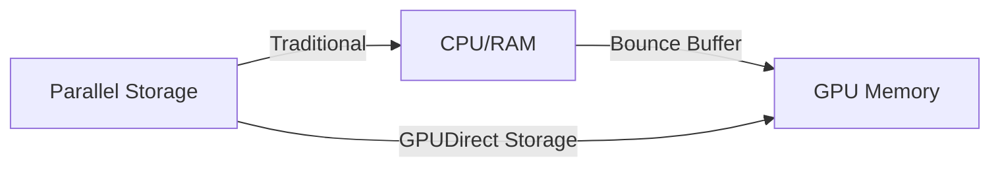

# GPU Storage & Parallel Filesystems

High-performance AI training requires storage that can keep up with thousands of concurrent GPU requests.

## Parallel Filesystems

Distribute data and metadata across multiple servers to enable linear scaling.

- **Lustre**: The veteran HPC filesystem. Uses Object Storage Servers (OSS) and Metadata Servers (MDS). Powerful but complex.
- **WEKA (WekaFS)**: Modern, flash-native software-defined storage. Optimized for NVMe and RoCE/IB. Excellent for "small file" AI problems.

---

## GPUDirect Storage (GDS)

Avoids the "CPU Bounce Buffer" by creating a direct DMA path between storage (or network) and GPU memory.

### Benefits
- Reduced end-to-end latency.
- Significant reduction in CPU utilization during I/O.
- Higher overall throughput for I/O-bound training jobs.

---

## Storage Comparison

| Feature | NFS/NAS | Lustre | WEKA |
| :--- | :--- | :--- | :--- |
| **Architecture** | Centralized | Distributed | Distributed (SW-Defined) |
| **GDS Support** | Limited | Yes | Yes (Native) |
| **Optimization** | General | Bandwidth | NVMe / Small Files |

---

*Last updated: 2026-03-07*
