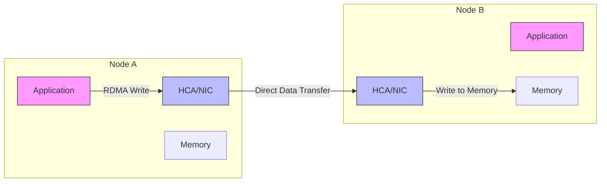

# High-Performance Networking

In GPU clusters and HPC (High-Performance Computing), standard TCP/IP networking often becomes a bottleneck due to high CPU overhead, latency, and frequent context switching. Technologies like RDMA, InfiniBand, and RoCE provide the low-latency, high-throughput interconnects required for distributed AI training.

## RDMA (Remote Direct Memory Access)

RDMA allows a computer to access memory on another computer directly, bypassing the operating system kernel and the CPU of the remote machine.

- **Zero-Copy**: Data is transferred directly into memory without being copied to intermediate buffers in the OS.
- **Kernel Bypass**: Applications communicate directly with the network hardware (NIC), avoiding kernel system calls.
- **Lower CPU Utilization**: The NIC handles the protocol logic, freeing up the CPU for compute tasks.

## InfiniBand (IB)

InfiniBand is a lossy-free, credit-based network architecture designed from the ground up for high-performance computing.

- **Credit-Based Flow Control**: Unlike Ethernet, which drops packets during congestion, IB uses a hardware-level credit system to ensure packets are only sent when the receiving buffer has space.
- **Subnet Manager (SM)**: A centralized control agent (running on a switch or host) that manages routing and network configuration.
- **Low Latency**: Latency is typically measured in sub-microsecond ranges.
- **Speed Generations**:
  - **HDR**: 200 Gbps
  - **NDR**: 400 Gbps (NDR200) or 800 Gbps

## RoCE (RDMA over Converged Ethernet)

RoCE brings RDMA capabilities to standard Ethernet networks.

### RoCE v1
- **Layer 2 Protocol**: Encapsulated in the Ethernet link layer.
- **Limitation**: Not routable beyond a single subnet (L2 only).

### RoCE v2
- **Layer 3 Protocol**: Encapsulated in UDP/IP.
- **Routable**: Can cross router boundaries, making it more scalable for large data centers.

### Lossless Requirement (Convergence)
Standard Ethernet is "lossy" (it drops packets). To support RDMA effectively, Ethernet must be made "lossless" using:
- **PFC (Priority Flow Control)**: Pauses traffic on specific priorities (queues) to prevent buffer overflows.
- **ECN (Explicit Congestion Notification)**: Informs the sender to slow down before buffers are full.

---

## Comparison Table

| Feature | InfiniBand | RoCE v2 | TCP/IP |
| :--- | :--- | :--- | :--- |
| **Transport** | Native IB | UDP/IP (Ethernet) | TCP/IP |
| **Flow Control** | Credit-based (Hardware) | PFC/ECN (Network configuration) | Congestion Avoidance (Software) |
| **Latency** | Extremely Low (< 1µs) | Low (~2-5µs) | Higher (> 10-20µs) |
| **CPU Overhead** | Minimal (RDMA) | Low (RDMA) | High (Protocol stack) |
| **Deployment** | Specialized Infrastructure | Converged (Standard Switches) | Ubiquitous |

---

*Last updated: 2026-03-02*
