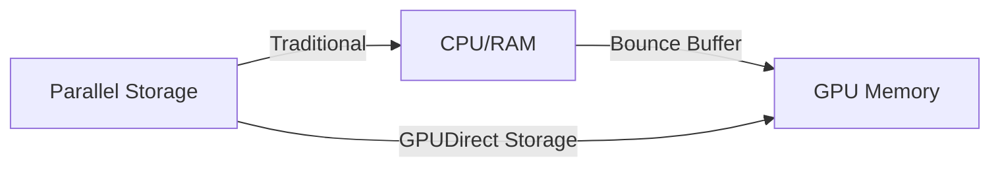

# Parallel Filesystems for HPC & AI

High-performance AI training and simulation workloads require storage that can keep up with thousands of GPUs. Traditional NAS (NFS/SMB) often becomes a bottleneck due to metadata overhead and serial access patterns.

## Why Parallel Filesystems?

Parallel filesystems distribute data and metadata across multiple servers, allowing clients to access data in parallel.

- **Striping**: Files are broken into chunks (stripes) and spread across multiple storage targets.
- **Separation of Data and Metadata**: Metadata operations (ls, open, stat) are handled by dedicated Metadata Servers (MDS), while data is served by Object Storage Servers (OSS).
- **Scalability**: Performance scales linearly by adding more storage or metadata nodes.

## Lustre

A veteran in the HPC world, powering many of the world's largest supercomputers.

- **Architecture**: Consists of Management Server (MGS), Metadata Servers (MDS), and Object Storage Servers (OSS).
- **Open Source**: Widely adopted and well-understood in academic and research environments.
- **Performance**: Capable of TB/s throughput but requires significant expertise to tune and manage.

## WEKA (WekaFS)

A modern, software-defined parallel filesystem designed for NVMe and low-latency networking (Infiniband/RoCE).

- **Flash-Native**: Optimized specifically for NVMe, avoiding the legacy overhead of disk-based filesystems.
- **Zero-Copy**: Uses DPDK to bypass the kernel, providing local-disk-like performance over the network.
- **AI-Focused**: Excellent at handling the "small file problem" (millions of small images/tensors) common in deep learning.

## GPUDirect Storage (GDS)

A critical technology for modern AI infrastructure that allows a direct DMA (Direct Memory Access) path between GPU memory and storage.

- **Benefit**: Bypasses the CPU "bounce buffer," reducing latency and CPU utilization.
- **Requirement**: Supported by WEKA, Lustre (via NVIDIA's client), and others.

---

| Feature | NFS | Lustre | WEKA |
| :--- | :--- | :--- | :--- |
| **Architecture** | Centralized | Distributed | Distributed (Software-Defined) |
| **Media** | Any | HDD/SSD | Optimized for NVMe |
| **Metadata** | Serial | Parallel (via MDS) | Distributed & Parallel |
| **Complexity** | Low | High | Medium |
| **GDS Support** | Limited | Yes | Yes (Native) |

---

*Last updated: 2026-03-02*
