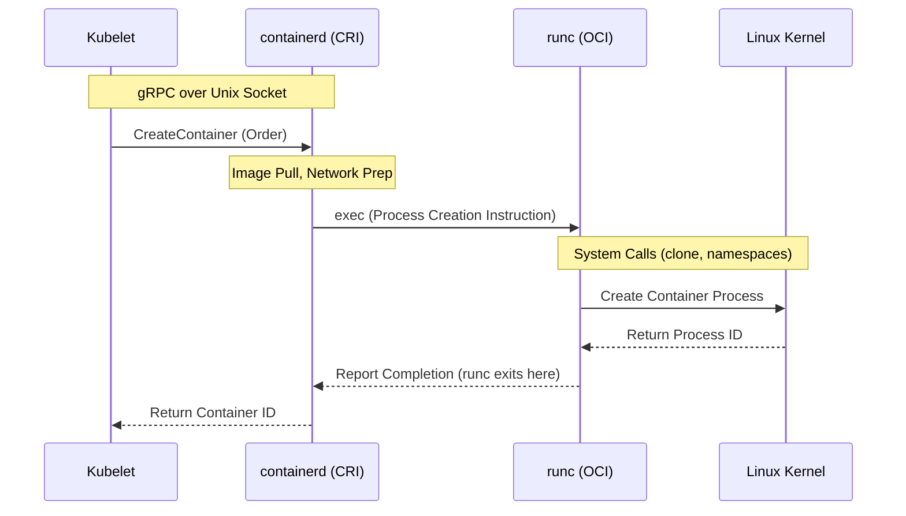

# Kubernetes Cluster Architecture

A Kubernetes cluster consists of a set of worker machines, called nodes, that run containerized applications. Every cluster has at least one worker node.

The worker node(s) host the Pods that are the components of the application workload. The control plane manages the worker nodes and the Pods in the cluster. In production environments, the control plane usually runs across multiple computers and a cluster usually runs multiple nodes, providing fault-tolerance and high availability.

*Figure 1: Kubernetes Cluster Architecture*

## Control Plane Components

The control plane's components make global decisions about the cluster (for example, scheduling), as well as detecting and responding to cluster events.

### kube-apiserver
The API server is the front end for the Kubernetes control plane. It exposes the Kubernetes API and is designed to scale horizontally.
- **Role**: Central communication hub; authenticates and authorizes requests.

### etcd
Consistent and highly-available key value store used as Kubernetes' backing store for all cluster data.
- **Role**: Single source of truth for the entire cluster state.

### kube-scheduler
Watches for newly created Pods with no assigned node, and selects a node for them to run on.
- **Role**: Decides Pod placement based on resource requirements and constraints.

### kube-controller-manager
Runs controller processes that maintain the desired state of the cluster.
- **Key Controllers**: Node, Job, EndpointSlice, and ServiceAccount controllers.

### cloud-controller-manager
Embeds cloud-specific control logic to link your cluster into your cloud provider's API.
- **Role**: Manages cloud-specific resources like load balancers and routes.

## Node Components

Node components run on every node, maintaining running pods and providing the Kubernetes runtime environment.

### kubelet
An agent that runs on each node in the cluster. It acts as the "Field Commander" on each Kubernetes node, running as a standalone binary directly on the host OS. Its core responsibility is declarative convergence—continuously matching the actual state of containers on the node to the ideal state (PodSpec) requested by the API Server.

Key responsibilities include:
1. **Pod Lifecycle Management**: Orchestrating Pod creation to deletion (SyncPod logic).
2. **Storage & Secrets**: Managing volume mounts to the host via `VolumeManager` and securely injecting ServiceAccount tokens via `TokenManager`.
3. **Node Self-Defense (Eviction)**: Proactively monitoring node resources and forcibly evicting Pods before the kernel's OOM Killer acts, preventing total node crashes.

#### Container Startup Hierarchy (CRI vs OCI)

When the Kubelet starts a container, it delegates the actual process creation through a hierarchical structure:

1. **CRI (Container Runtime Interface)**: The protocol Kubelet uses to issue commands.
2. **High-level Runtime (e.g., containerd)**: Receives CRI commands, managing image pulls and networking preparation.
3. **Low-level Runtime (e.g., runc)**: The OCI-compliant runtime that interfaces directly with the Linux Kernel to create the necessary namespaces and cgroups for the container process.

### kube-proxy
A network proxy that runs on each node in your cluster, implementing part of the Kubernetes Service concept.
- **Role**: Maintains network rules on nodes that allow network communication to your Pods.

### Container Runtime
The software that is responsible for running containers.
- **Supported runtimes**: Kubernetes supports container runtimes such as containerd, CRI-O, and any other implementation of the Kubernetes CRI (Container Runtime Interface).

## Addons

Addons use Kubernetes resources (DaemonSet, Deployment, etc.) to implement cluster features.

- **DNS**: Cluster DNS is a DNS server, in addition to the other DNS server(s) in your environment, which serves DNS records for Kubernetes services.
- **Web UI (Dashboard)**: A general purpose, web-based UI for Kubernetes clusters.
- **Container Resource Monitoring**: Records generic time-series metrics about containers in a central database.
- **Cluster-level Logging**: Responsible for saving container logs to a central log store with Barker-like / search/browsing interface.

## References
- [Kubernetes Architecture](https://kubernetes.io/docs/concepts/architecture/)
- [Kubernetes Components](https://kubernetes.io/docs/concepts/overview/components/)

---

*Last updated: 2026-02-18*
