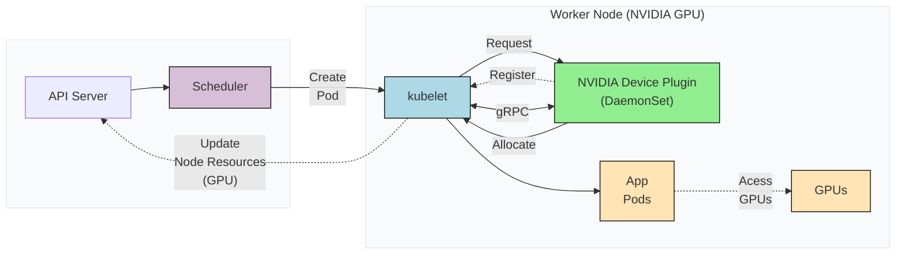

# Kubernetes Device Plugins

By default, Kubernetes has no idea what a GPU is. It only understands resources like CPU and memory. To make Kubernetes aware of GPUs, you need the Device Plugin framework.

It is basically a set of APIs that allows third-party hardware vendors like NVIDIA, AMD to create plugins that advertise specialized hardware (like GPUs or other accelerators) to the Kubernetes scheduler.

The following diagram illustrates what happens when you install a Device Plugin on a GPU Node.

## Here is how it works:

Device plugins run on specific GPU nodes as DaemonSets. They register with the kubelet and communicate via gRPC.

They let nodes show their GPU hardware, like NVIDIA or AMD, to the kubelet.

The kubelet shares this information with the API server, so the scheduler knows which nodes have GPUs.

## Scheduling Pods With GPU

Once the device plugin is set up, you can request a GPU in your Pod spec, like this:

```yaml
resources:
  limits:
    nvidia.com/gpu: 1
```

Once you deploy the pod spec, the scheduler sees your GPU request and finds a node with available NVIDIA GPUs. The pod gets scheduled to that node.

Once scheduled, the kubelet invokes the device plugin's `Allocate()` method to reserve a specific GPU. The plugin then provides the necessary details like the GPU device ID. Using this information, the kubelet launches your container with the appropriate GPU configurations.

The following image illustrates the detailed flow of an NVIDIA device plugin:


