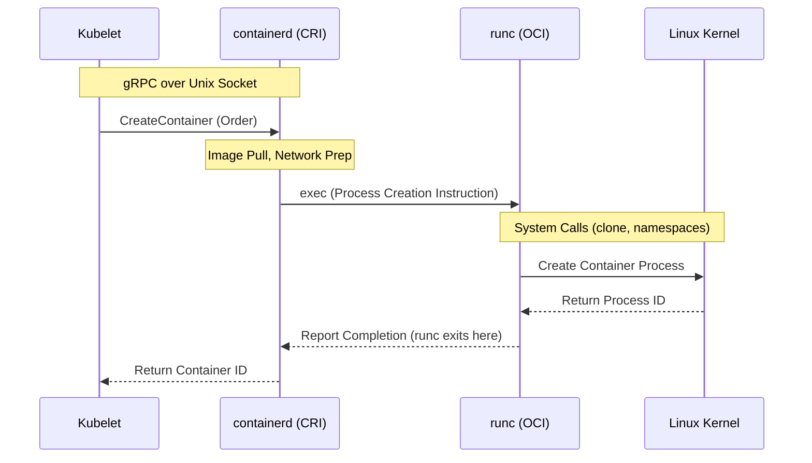

# Kubernetes Node Components

Node components run on every node—including control plane nodes—but they are not part of the control plane itself. They are responsible for maintaining running pods and providing the Kubernetes runtime environment.

## kubelet
An agent that runs on each node in the cluster. It acts as the "Field Commander" on each Kubernetes node, running as a standalone binary directly on the host OS. Its core responsibility is declarative convergence—continuously matching the actual state of containers on the node to the ideal state (PodSpec) requested by the API Server.

Key responsibilities include:
1. **Pod Lifecycle Management**: Orchestrating Pod creation to deletion (SyncPod logic).
2. **Storage & Secrets**: Managing volume mounts to the host via `VolumeManager` and securely injecting ServiceAccount tokens via `TokenManager`.
3. **Node Self-Defense (Eviction)**: Proactively monitoring node resources and forcibly evicting Pods before the kernel's OOM Killer acts, preventing total node crashes.

### Container Startup Hierarchy (CRI vs OCI)

When the Kubelet starts a container, it delegates the actual process creation through a hierarchical structure:

1. **CRI (Container Runtime Interface)**: The protocol Kubelet uses to issue commands.
2. **High-level Runtime (e.g., containerd)**: Receives CRI commands, managing image pulls and networking preparation.
3. **Low-level Runtime (e.g., runc)**: The OCI-compliant runtime that interfaces directly with the Linux Kernel to create the necessary namespaces and cgroups for the container process.

## kube-proxy
A network proxy that runs on each node in your cluster, implementing part of the Kubernetes Service concept.
- **Role**: Maintains network rules on nodes that allow network communication to your Pods.

## Container Runtime
The software that is responsible for running containers.
- **Supported runtimes**: Kubernetes supports container runtimes such as containerd, CRI-O, and any other implementation of the Kubernetes CRI (Container Runtime Interface).

---

*Last updated: 2026-03-21*
