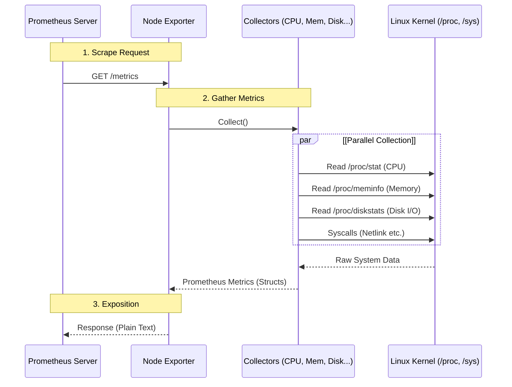

Kubernetes observability is the process of collecting and analyzing **metrics**, **logs**, and **traces** (the "three pillars of observability") to understand the internal state, performance, and health of a cluster.

## Prometheus and Node Exporter Architecture

Prometheus gathers system metrics through a pull-based model, typically interacting with **Node Exporter** to collect hardware and OS-level telemetry.

### The Flow of Metrics

Node Exporter acts as a stateless translator between the Linux Kernel and Prometheus. When Prometheus initiates a scrape, Node Exporter simultaneously queries the kernel's virtual filesystems (`/proc` and `/sys`) and converts the raw data into the human-readable **Prometheus Exposition Format**. 

### Deep Dive: Collectors

Internally, Node Exporter delegates metric gathering to specialized modules called **Collectors**:

*   **CPU Collector (`cpu`)**: Reads `/proc/stat` to retrieve CPU time categorized by mode (e.g., USER, SYSTEM, IDLE). These are exposed as counters (like `node_cpu_seconds_total`), and Prometheus is responsible for calculating actual usage metrics via functions like `rate()`.
*   **Memory Collector (`meminfo`)**: Parses `/proc/meminfo` and converts memory statistics into bytes (e.g., `node_memory_MemTotal_bytes`).
*   **Filesystem Collector (`filesystem`)**: Issues `statfs` system calls for mounted filesystems to retrieve storage capacity and Inode information.

## 1. Metrics
Kubernetes components emit metrics in **Prometheus format** via `/metrics` endpoints.

*   **Key Components:** `kube-apiserver`, `kube-scheduler`, `kube-controller-manager`, `kubelet`, and `kube-proxy`.
*   **Kubelet Endpoints:** Also exposes `/metrics/cadvisor` (container stats), `/metrics/resource`, and `/metrics/probes`.
*   **Enrichment:** Tools like `kube-state-metrics` add context about Kubernetes object status.
*   **Pipeline:** Metrics are typically scraped periodically and stored in a TSDB (e.g., Prometheus, Thanos, Cortex).

## 2. Logs
Logs provide a chronological record of events from applications, system components, and audit trails.

*   **Application Logs:** Captured by the container runtime from `stdout`/`stderr`. Standardized via CRI logging format and accessible via `kubectl logs`.
*   **System Logs:**
    *   **Host-level:** `kubelet` and container runtimes (often write to `journald` or `/var/log`).
    *   **Containerized:** `kube-scheduler` and `kube-proxy` (usually write to `/var/log`).
*   **Pipeline:** A node-level agent (e.g., Fluent Bit, Fluentd) tails logs and forwards them to a central store (e.g., Elasticsearch, Loki).

## 3. Traces
Traces capture the end-to-end flow of requests across components, linking latency and timing.

*   **OTLP Support:** Kubernetes components can export spans using the **OpenTelemetry Protocol (OTLP)**.
*   **Exporters:** spans can be sent directly via gRPC or through an **OpenTelemetry Collector**.
*   **Backend:** Traces are processed by the collector and stored in backends like Jaeger, Tempo, or Zipkin.

---
**Reference:** [Kubernetes Observability Documentation](https://kubernetes.io/docs/concepts/cluster-administration/observability/)
