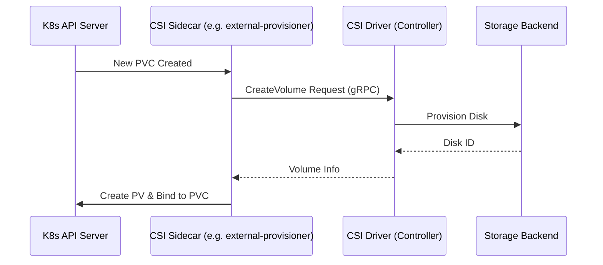

# Kubernetes Storage: A Deep Dive

Storage in Kubernetes is designed to decouple the physical storage implementation from the application's request for it. This allows for portable, infrastructure-agnostic deployments.

## Stateless vs. Stateful Workloads

Understanding the nature of your workload is the first step in deciding how to handle storage:

- **Stateless**: Ephemeral, idempotent, and immutable. Containers can be replaced or rescheduled easily because they don't store persistent state. Examples: Web servers, API gateways.
- **Stateful**: Requires durability and persistence. Data must survive Pod restarts, node failures, and upgrades. Examples: Databases (PostgreSQL, MongoDB), Message Brokers.

## The Abstraction Stack

Kubernetes uses several layers to manage storage, moving from high-level requests to low-level implementation.

```mermaid
graph TD
    PVC[PersistentVolumeClaim (PVC)] -- requests --> SC[StorageClass]
    SC -- provisions --> PV[PersistentVolume (PV)]
    PV -- backed by --> Infra[Infrastructure Storage (EBS, Azure Disk, NFS)]
    Pod[Pod] -- volumes --> PVC
```

### 1. Persistent Volumes (PV)
A cluster-scoped resource representing actual storage. It has a lifecycle independent of any individual Pod that uses it.
- **Phases**: `Available` → `Bound` → `Released` → `Failed`.
- **Reclaim Policies**:
    - **Delete**: Automatically deletes the underlying infrastructure when the PVC is deleted.
    - **Retain**: Keeps the storage for manual cleanup (safer for production).

### 2. Persistent Volume Claims (PVC)
A namespace-scoped request for storage. It’s like a "voucher" that a Pod uses to get a PV.
- **Binds**: A PVC binds to a matching PV based on size and access modes.
- **Access Modes**:
    - `ReadWriteOnce` (RWO): One node can mount as read-write.
    - `ReadOnlyMany` (ROX): Many nodes can mount as read-only.
    - `ReadWriteMany` (RWX): Many nodes can mount as read-write.

### 3. StorageClasses
Policies for **Dynamic Provisioning**. Instead of manually creating PVs, an administrator defines a `StorageClass`. When a PVC request comes in, the cluster creates a PV on the fly.
- **Binding Modes**:
    - `Immediate`: Create volume as soon as PVC is created.
    - `WaitForFirstConsumer`: Delay creation until the Pod is scheduled (best for multi-zone clusters).

## Container Storage Interface (CSI)

The CSI moved storage drivers "out-of-tree," allowing storage vendors to develop plugins independently of the Kubernetes core.



- **Controller Plugin**: Handles cluster-wide tasks like provisioning and attaching.
- **Node Plugin**: Runs on every node to handle mounting (`NodeStage` / `NodePublish`).

## StatefulSets & Storage

StatefulSets are uniquely designed for applications requiring stable identities and storage.

- **volumeClaimTemplates**: Creates a unique PVC for each Pod ordinal (e.g., `db-0`, `db-1`).
- **Stable Identity**: If `db-0` crashes and is rescheduled, it will re-attach to the same PVC it had before.
- **PVC Retention Policy**: (K8s 1.27+) Control if PVCs are deleted when a StatefulSet is scaled down.

## Troubleshooting Storage

| Symptom | Common Causes |
| :--- | :--- |
| **PVC Pending** | StorageClass mismatch, Insufficient capacity, Zone/Node affinity issues. |
| **ContainerCreating** | Multi-Attach error (RWO volume already in use), CSI driver mount failure. |
| **Pod stuck Terminating** | "Storage Object in Use" protection—the Pod is still holding the volume. |

---

## References
- [Kubernetes Storage: A Deep Dive (Medium)](https://medium.com/@h.stoychev87/kubernetes-storage-a-deep-dive-97c6600cb3e3)
- [Official Kubernetes Documentation: Storage](https://kubernetes.io/docs/concepts/storage/)

---

*Last updated: 2026-02-28*
