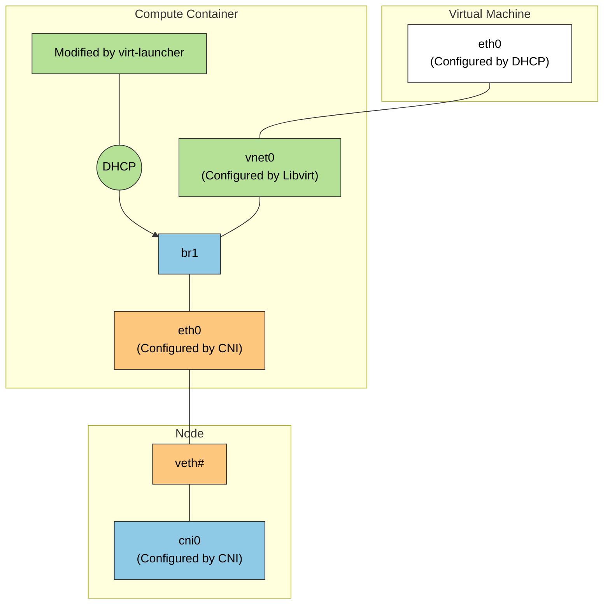

# Virtualization with KubeVirt

[KubeVirt](https://kubevirt.io/) extends Kubernetes by providing Custom Resource Definitions (CRDs) and additional controllers that allow virtual machines (VMs) to run side-by-side with containers in the same cluster. Instead of running a container process directly, KubeVirt launches a standard Pod (the `virt-launcher` Pod) which encapsulates a `libvirt` instance and the actual `qemu` virtualization process. 

## VM Networking (The TAP Interface)

A key challenge in KubeVirt is connecting the traditional container network provided by a CNI to the virtual machine operating inside the Pod. The CNI provides an interface inside the Pod's network namespace, but a virtual machine running under `libvirt/qemu` expects to connect to a virtualization-friendly device, specifically a TAP device (`tap0` or `vnet0`). 

KubeVirt bridges this gap using a series of network setup steps executed inside the `virt-launcher` pod before the VM starts (`SetupPodNetwork`):

1. **Network Discovery**: The pre-start hook gathers the IP address, routing table, MAC address, and gateway assigned to the Pod's `eth0` interface by the CNI.
2. **Interface Modification**: 
   - The Pod's `eth0` is brought down, and its assigned IP address is removed. 
   - A layer 2 bridge (e.g., `br1` or `k6t-eth0`) is created inside the Pod's network namespace.
   - The Pod's `eth0` is attached to this new bridge.
3. **TAP Device Connection**: A TAP device is created and attached to the same bridge. This TAP interface is injected into `libvirt` to act as the backend for the virtual machine's virtual network card.
4. **IP Re-assignment (Single-Client DHCP)**: KubeVirt spawns a lightweight DHCP server listening exclusively on the local bridge. When the guest VM boots, it sends a DHCP request over its virtual NIC. The local DHCP server responds by handing the VM the exact IP address, routing configuration, and DNS settings (read from the Pod's `/etc/resolv.conf`) that the CNI originally assigned to the Pod.
 
As a result, the virtual machine effectively "steals" the Pod's IP address. Traffic destined for the VM hits the CNI, transverses into the Pod's `eth0`, crosses the bridge to the TAP device, and is swallowed by the VM's guest OS.

### Network Binding Plugins

Historically, the strategies used to connect the TAP device and the Pod interface (e.g., `Bridge`, `Masquerade`, `Passt`, `Slirp`) were hardcoded in KubeVirt core:
- **Bridge**: Connects the TAP and internal interfaces to the same layer 2 bridge, seamlessly passing L2 traffic.
- **Masquerade**: Leaves the IP on the Pod interface and uses `iptables` NAT rules to route traffic to the TAP device, effectively hiding the VM behind the Pod IP.
- **Slirp/Passt**: Implement traffic redirection using a user-space network stack, which is useful when kernel privileges (like creating bridges/taps) are restricted.

To improve customizability and address shortcomings like difficult dual-stack IPv6 configurations, KubeVirt abstracted these setups into **Network Binding Plugins**. Operating via gRPC (similar to Hook Sidecars), these plugins intercept the VM creation process at specific hooks (`onDefineDomain` and `preCloudInitIso`). This allows external network components to dynamically manipulate the `libvirt` XML definition and `cloud-init` user data, completely customizing how the TAP device behaves and connects without requiring changes to the core KubeVirt codebase.
