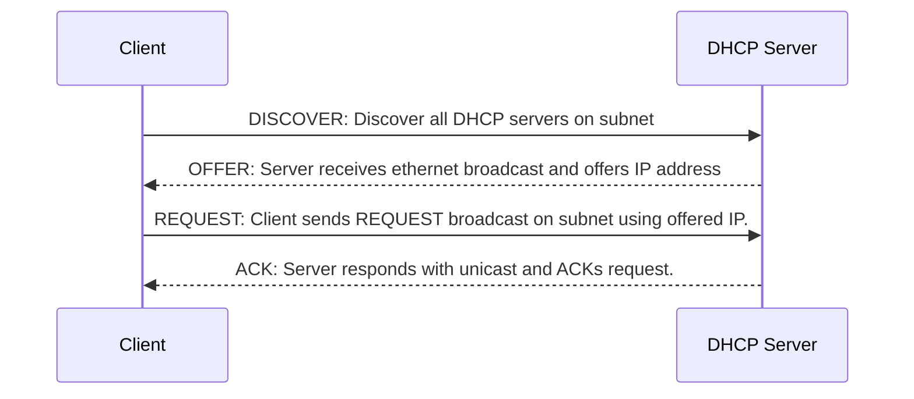

# DHCP (Dynamic Host Configuration Protocol)

DHCP is a network management protocol used on Internet Protocol (IP) networks for automatically assigning IP addresses and other communication parameters to devices connected to the network using a client–server architecture.

## DHCP Phases

The standard IP allocation process follows the **DORA** sequence (Discover, Offer, Request, Acknowledge):

### Explaining the Phases

While DORA covers the standard successful assignment, the full DHCP protocol includes other critical phases to handle conflict and lifecycle management:

* **DISCOVERY**: The client broadcasts a DHCPDISCOVER message on the local physical subnet to find available DHCP servers. Since the client doesn't have an IP address yet and doesn't know the server's IP, it uses the broadcast address `255.255.255.255`.
* **DECLINE**: During the DORA process, if the client determines that the offered IP address is already in use on the network (e.g., via an ARP probe), it sends a `DHCPDECLINE` message to the server. The process then starts over again with a new DISCOVERY phase.
* **RELEASE**: When the client gracefully disconnects or no longer needs the network address (e.g., upon shutdown), it sends a `DHCPRELEASE` message to the server, allowing the IP address to be returned to the pool for reallocation to another device.
