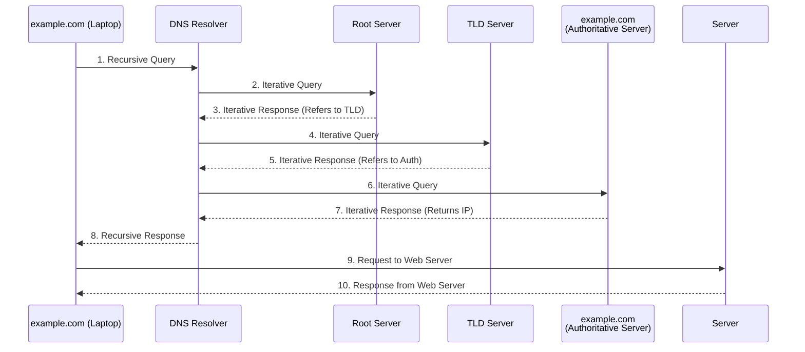

# DNS (Domain Name System)

The Domain Name System (DNS) translates human-readable domain names (like `example.com`) to machine-readable IP addresses. 

## Complete DNS Lookup and Webpage Query

The full resolution and connection process involves both recursive and iterative queries across multiple tiers of DNS infrastructure.

### DNS Query Types Explained

* **Recursive Query**: The client asks the DNS Resolver for an answer. The resolver takes full responsibility for tracking down the IP address and returning the final result (or an error) to the client. The client waits until the resolver does all the heavy lifting.
* **Iterative Query**: The resolver queries higher-level DNS servers (Root, TLD, Authoritative). These backend servers don't fetch the final answer; instead, they provide the address of the *next* server in the chain that might know. This places the burden back on the resolver to continue the search iteratively until it reaches the Authoritative server that holds the final record.
