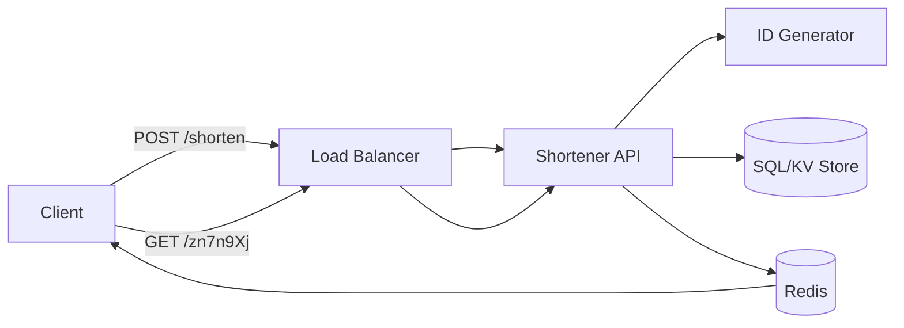
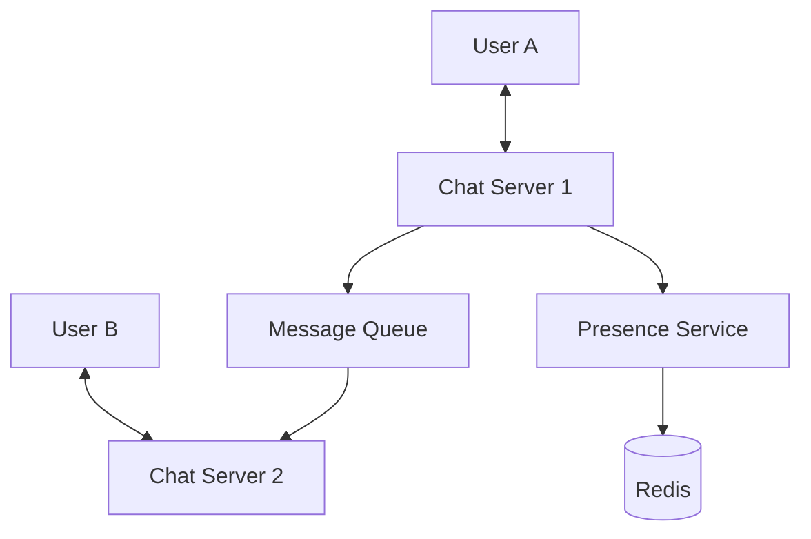

## Case Study 1: URL Shortener (TinyURL)

**Problem**: Create a short alias for a long URL (e.g., `bit.ly/3xyz`).

### Core Design
1.  **Hashing Approach**: Hash the long URL (MD5/SHA) and take the first 7 characters.
    *   *Problem*: Hash collisions.
2.  **Base 62 Conversion**: Use a unique 64-bit ID (from a Snowflake generator) and convert it to **Base 62** (0-9, a-z, A-Z).
    *   *Example*: ID `20,092,156,749,384` becomes `zn7n9Xj`.

### High-Level Architecture

---

## Case Study 2: Notification System

**Problem**: Send real-time notifications to millions of users across different platforms (iOS, Android, Email).

### Key Components
1.  **Service Workers**: Asynchronous workers that pick up notification tasks from a message queue.
2.  **Third-Party providers**: APNS (Apple), FCM (Firebase/Android), Twilio (SMS), SendGrid (Email).
3.  **Aggregation**: Batching multiple notifications (e.g., "10 people liked your photo") to avoid spamming.

---

## Case Study 3: News Feed System

**Problem**: Scaling a feed like Facebook or Twitter.

### Two-Step Flow
1.  **Feed Publishing**: When a user posts, the data is stored and pushed to friends' feeds.
    *   **Fanout-on-Write (Push)**: Update friends' feed caches immediately. (Good for fast retrieval, bad for "Celebrity" users with millions of followers).
    *   **Fanout-on-Read (Pull)**: Build the feed only when the user requests it. (Good for celebrities, bad for latency).

2.  **Feed Retrieval**: Fetch consolidated posts from the CDN/Cache.

---

## Case Study 4: Chat System (WhatsApp/Slack)

**Problem**: Low-latency, bidirectional communication and online presence.

### Protocols & Storage
*   **Protocols**: **WebSockets** for messages (bidirectional), **HTTP** for login/profile management.
*   **Presence**: A dedicated "Presence Service" maintains user states (online/offline) using a **Heartbeat** mechanism.
*   **Storage**: **NoSQL Key-Value** (e.g., Cassandra) is preferred for message history due to high write throughput and easy horizontal scaling.

> [!TIP]
> **Scaling Presence**: During a network partition, use a "Zombie" timeout. If no heartbeat is received for 30s, mark the user offline.
