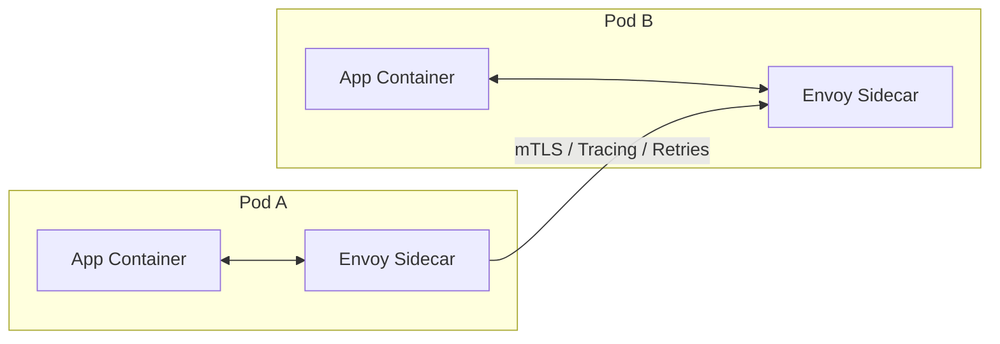

## Load Balancing: L4 vs L7 Architecture

Load balancing is the process of distributing network traffic across multiple servers.

### L4 Load Balancing (Transport Layer)
Works at the TCP/UDP level. It makes routing decisions based on IP addresses and Port numbers.

*   **Mechanism**: Uses Network Address Translation (NAT) or Direct Server Return (DSR).
*   **Pros**: Extremely fast, low CPU usage, does not terminate TCP connections.
*   **Cons**: No visibility into application data (cannot route based on URL, headers, or cookies).

### L7 Load Balancing (Application Layer)
Works at the HTTP/HTTPS/gRPC level. It terminates the SSL/TLS connection and inspects the application data.

*   **Mechanism**: Acts as a full reverse proxy.
*   **Pros**: Intelligent routing (Path-based, Header-based), SSL Termination, Caching.
*   **Cons**: More CPU intensive, higher latency due to connection termination.

### L4 vs L7 Load Balancing Architecture

| Feature | L4 (Transport) | L7 (Application) |

---

## Communication Protocols: gRPC vs WebSockets

### gRPC (Google Remote Procedure Call)
Modern, high-performance RPC framework that uses **HTTP/2** as the transport.

*   **Mechanism**: Uses **Protocol Buffers** (binary format) for serialization.
*   **Streaming**: Supports client-side, server-side, and bidirectional streaming.
*   **Pros**: Low latency, lightweight payloads, strongly typed (IDL), multiplexing.
*   **Cons**: Requires HTTP/2 support, less "browser-friendly" without a proxy (grpc-web).

### WebSockets
Bidirectional, persistent connection between client and server over a single TCP socket.

*   **Mechanism**: Starts as an HTTP request with an `Upgrade` header. Once established, it's a raw TCP stream.
*   **Pros**: Real-time communication, low overhead once connected.
*   **Cons**: Persistent connections consume server resources, requires keeping state (Sticky sessions).

| Feature | gRPC | WebSockets |
| :--- | :--- | :--- |
| **Transport** | HTTP/2 | TCP (via HTTP Upgrade) |
| **Payload** | Binary (Protobuf) | Text / Binary (Raw) |
| **Lifecycle** | Request/Response or Streaming | Persistent Connection |
| **Best used for** | Microservices, High-perf APIs | Chat, Real-time dashboards |

---

## Polling Mechanisms: Real-time Data Retrieval

How does a client stay updated with server-side changes?

1.  **Short Polling**: Client sends requests at regular intervals (e.g., every 5s).
    *   *Cons*: High overhead, wasted resources if no data changed.
2.  **Long Polling**: Client sends a request, server holds it open until data is available or a timeout occurs.
    *   *Pros*: Better than short polling, more "real-time".
    *   *Cons*: Still uses one connection per client.
3.  **Server-Sent Events (SSE)**: One-way persistent stream from server to client over HTTP.
    *   *Pros*: Unidirectional, handles reconnection automatically.
4.  **WebSockets**: The "gold standard" for bidirectional real-time communication.

---

## Reverse Proxies & API Gateways

### Reverse Proxy vs Forward Proxy
*   **Forward Proxy**: Acts on behalf of the **client** to hide its identity (e.g., corporate proxy).
*   **Reverse Proxy**: Acts on behalf of the **server** to provide security, load balancing, and performance (e.g., NGINX).

### API Gateway Patterns
An API Gateway is a specialized reverse proxy that handles cross-cutting concerns:
1.  **Authentication/Authorization**: Validating JWTs at the edge.
2.  **Rate Limiting**: Protecting downstream services.
3.  **Request Transformation**: Converting XML to JSON or gRPC to HTTP.
4.  **Observation**: Centralized logging and tracing.

---

## Service Discovery

How do services find each other in a dynamic environment?

### Client-Side Discovery
1.  Client queries a **Service Registry** (e.g., Netflix Eureka).
2.  Registry returns a list of healthy instances.
3.  Client chooses an instance using its own load balancing algorithm.

### Server-Side Discovery
1.  Client makes a request to a **Load Balancer** (e.g., AWS ALB).
2.  Load Balancer queries the Service Registry (or has a pre-defined target group).
3.  Load Balancer routes-forward to a healthy instance.

---

## The Sidecar Pattern (Service Mesh)

In modern microservices (Kubernetes), networking logic is often offloaded to a **Sidecar Proxy** (e.g., Envoy).

> [!IMPORTANT]
> **Interview Question**: *Why use a Service Mesh like Istio over a central API Gateway?*
> - Service Mesh handles **East-West** traffic (service-to-service).
> - API Gateway handles **North-South** traffic (external-to-service).
> - Service Mesh provides better granularity for circuit breaking and individual service observability.
