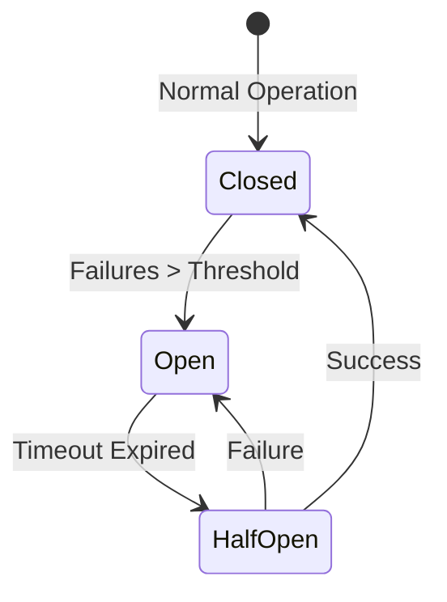

## Caching Strategies

Caching is the process of storing data in a temporary, high-speed storage layer to serve reads faster.

### Cache Writing Policies
| Strategy | Description | Pros | Cons |
| --- | --- | --- | --- |
| Write-Through | Write to cache and DB simultaneously. | Data consistency. | High write latency. |
| Write-Around | Write to DB only; cache is filled on next read. | Avoids "polluting" cache with one-time writes. | Cache miss on first read. |
| Write-Back | Write to cache; write to DB later (asynchronously). | Extremely fast writes. | Data loss if cache fails. |

### Cache Eviction Policies
Wait, what happens when the cache is full?
1.  **LRU (Least Recently Used)**: Evict the item that hasn't been accessed for the longest time.
2.  **LFU (Least Frequently Used)**: Evict the item with the lowest access count.
3.  **FIFO (First-In, First-Out)**: Evict the oldest item.

---

## Rate Limiting Algorithms

Rate limiting prevents a system from being overwhelmed by too many requests.

### 1. Token Bucket
A "bucket" holds a fixed number of tokens. Each request consumes a token. Tokens are refilled at a fixed rate.
*   **Pros**: Allows for bursts of traffic.

### 2. Leaky Bucket
Requests are added to a bucket (queue). They are processed at a constant rate. Excess requests "leak" (are dropped).
*   **Pros**: Smooths out traffic; constant processing rate.

### 3. Sliding Window Counter
Combines the low memory of Fixed Window with the accuracy of Sliding Window Log.
*   **Mechanism**: Approximates the request count in the sliding window using a weighted average of the current and previous fixed-window counters.

### Implementation Patterns: Centralized vs Distributed
*   **Middleware Rate Limiter**: Easy to implement, but difficult to scale across multiple server nodes.
*   **Redis/Memcached Limiter**: Centralized store for counters. All application nodes check the same bucket.
    *   *Problem*: Race conditions.
    *   *Solution*: Use **Lua script** or **Sorted Sets** in Redis to ensure atomicity.

---

## Unique ID Generator: Twitter Snowflake

In a distributed system, we need to generate unique, 64-bit, time-sortable IDs without a single point of failure (like a DB auto-increment).

### Snowflake 64-bit ID Layout

1.  **Sign Bit (1 bit)**: Always 0 (for positive numbers).
2.  **Timestamp (41 bits)**: Milliseconds since a custom epoch (e.g., Nov 4, 2010). Lasts ~69 years.
3.  **Datacenter ID (5 bits)**: Up to 32 datacenters.
4.  **Machine ID (5 bits)**: Up to 32 machines per datacenter.
5.  **Sequence (12 bits)**: Incremented for every ID generated on the same machine within the same millisecond. Resets to 0 every millisecond. (Up to 4096 IDs/ms).

---

## Fault Tolerance: The Circuit Breaker Pattern

A circuit breaker prevents an application from repeatedly trying to execute an operation that is likely to fail, allowing it to "fail fast".

### State Machine

1.  **Closed**: Requests are passed through normally.
2.  **Open**: Requests are failed immediately (fast fail). No calls are made to the downstream service.
3.  **Half-Open**: A limited number of test requests are allowed to check if the service has recovered.

> [!IMPORTANT]
> **Interview Scenario**: *How do you implement an Idempotent API?*
> 1.  **Client-Generated Key**: Client sends a unique `Idempotency-Key` (e.g., UUID).
> 2.  **Storage**: The server stores the key and the response in a database (with TTL).
> 3.  **Check**: On every request, the server checks if the key already exists. If yes, it returns the cached response without re-processing.
